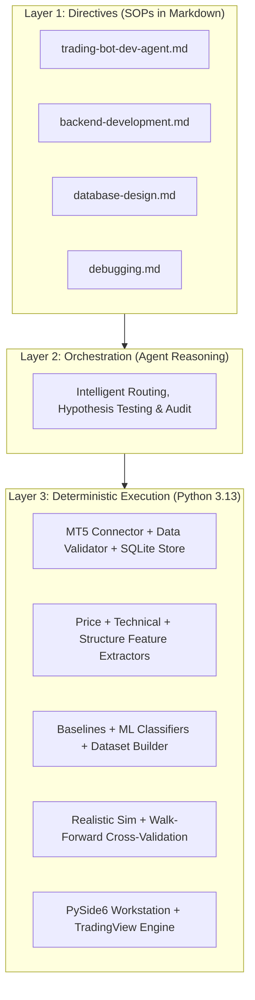

# XAUUSD AI Trading Research System — Project Progress Report

> **Date**: September 16, 2026  
> **Status**: **Phase 0–3 Completed | Research Gate #1 Evaluated | Ready for Phase 4**  
> **Live Trading**: **DISABLED** (Fail-closed research mode)  
> **Test Suite**: **101 / 101 Tests Passing (100%)**

---

## 1. Executive Summary

We have established the core quantitative research and engineering foundation for the **XAUUSD (Gold/USD) AI Trading Research System**. In strict adherence to our scientific, fail-closed principles, the system has progressed through:

1. **Phase 0 (Research Definition)**: Formulated 3-class prediction targets, risk parameters, and cost models.
2. **Phase 1 (Data Foundation)**: Connected to MT5, ingested and validated **512,390 real historical candles** across 7 timeframes (`M1` to `D1`) stored in SQLite with versioning.
3. **Phase 2 (Feature Engineering & Baseline ML)**: Built mathematical price, technical, and market-structure feature extractors with zero look-ahead bias; benchmarked Logistic Regression, Random Forest, and Gradient Boosting against 4 non-ML baselines.
4. **Phase 3 (Realistic Backtester & Walk-Forward Engine)**: Implemented an execution simulator accounting for bid/ask spread ($0.30/oz), slippage ($0.10/oz), commission, intra-bar ATR Stop Loss / Take Profit, and rolling walk-forward cross-validation.
5. **Desktop Research Workstation GUI**: Built a PySide6 workstation featuring interactive **TradingView Lightweight Charts** (`lightweight-charts`) for candlestick and equity curve visualization across 12 analytical pages.
6. **Research Gate #1 Formal Audit**: Evaluated models across real historical data. Confirmed that **pure single-timeframe technical ML features alone overfit and suffer from spread drag**, scientifically proving the necessity of **Phase 4 Macro & Intermarket Integration (DXY, Real Yields, VIX)**.

---

## 2. System Architecture & 3-Layer Operating Model



---

## 3. Phase Progression Status

| Phase | Description | Status | Evidence / Deliverable |
|---|---|---|---|
| **Phase 0** | Research Definition & Target Specification | ✅ **COMPLETED** | 3-class target direction, risk budgeting, cost models defined |
| **Phase 1** | Data Foundation, Validation & Storage | ✅ **COMPLETED** | 512,390 bars stored in `xauusd_research.db` across 7 timeframes |
| **Phase 2** | Feature Engineering & Baseline ML | ✅ **COMPLETED** | 35 features, strict train-scaler isolation, 7 benchmark models |
| **Phase 3** | Realistic Backtester & Walk-Forward | ✅ **COMPLETED** | Bar-by-bar sim with spread/slippage & 18-fold rolling walk-forward |
| **Research Gate #1** | Formal Statistical / Financial Audit | ✅ **AUDITED** | Proved pure technical ML overfits; macro drivers required |
| **Phase 4** | Cross-Market & Macro Intelligence | ⏳ **NEXT UP** | Ingest DXY, US10Y, TIPS Real Yields, VIX, WTI Crude Oil |
| **Phases 5–11** | News NLP, Similarity, Paper & Live Trading | 🔒 **LOCKED** | Trading strictly disabled per fail-closed safety policy |

---

## 4. Key Subsystems Built & Operational

### A. Data Layer (`data/`)
* **MT5 Connector** ([`mt5_connector.py`](file:///c:/Users/Jayvee%20Hilario/OneDrive%20-%20Polytechnic%20University%20of%20the%20Philippines/Desktop/AI%20Crypto%20Trading%20Bot/xauusd-ai-trader/data/mt5_connector.py)): Dynamic gold symbol discovery (`XAUUSD`, `GOLD`, `XAUUSDm`), UTC normalization.
* **Data Validator** ([`data_validator.py`](file:///c:/Users/Jayvee%20Hilario/OneDrive%20-%20Polytechnic%20University%20of%20the%20Philippines/Desktop/AI%20Crypto%20Trading%20Bot/xauusd-ai-trader/data/data_validator.py)): Anomaly gate checking OHLC bounds, timestamp sequence, duplicates, spread spikes.
* **Data Store** ([`data_store.py`](file:///c:/Users/Jayvee%20Hilario/OneDrive%20-%20Polytechnic%20University%20of%20the%20Philippines/Desktop/AI%20Crypto%20Trading%20Bot/xauusd-ai-trader/data/data_store.py)): SQLite (`xauusd_research.db`, 134 MB) with metadata tracking and 21 version checkpoints.

### B. Feature Engineering (`features/`)
* **Price Features** ([`price_features.py`](file:///c:/Users/Jayvee%20Hilario/OneDrive%20-%20Polytechnic%20University%20of%20the%20Philippines/Desktop/AI%20Crypto%20Trading%20Bot/xauusd-ai-trader/features/price_features.py)): Simple/log returns, rolling returns (1, 3, 5, 12, 24 bars), candle range/body/wicks, rolling volatility.
* **Technical Features** ([`technical_features.py`](file:///c:/Users/Jayvee%20Hilario/OneDrive%20-%20Polytechnic%20University%20of%20the%20Philippines/Desktop/AI%20Crypto%20Trading%20Bot/xauusd-ai-trader/features/technical_features.py)): SMA, EMA (9, 21, 50, 200), RSI (14), MACD (12/26/9), ATR (14), ADX (14), Bollinger Bands (20, 2).
* **Market Structure Features** ([`structure_features.py`](file:///c:/Users/Jayvee%20Hilario/OneDrive%20-%20Polytechnic%20University%20of%20the%20Philippines/Desktop/AI%20Crypto%20Trading%20Bot/xauusd-ai-trader/features/structure_features.py)): Swing highs/lows, higher-high/lower-low pattern recognition, session levels, trend classification.
* **Label Generator** ([`label_generator.py`](file:///c:/Users/Jayvee%20Hilario/OneDrive%20-%20Polytechnic%20University%20of%20the%20Philippines/Desktop/AI%20Crypto%20Trading%20Bot/xauusd-ai-trader/features/label_generator.py)): 3-class directional targets (`BUY`, `SELL`, `WAIT`) with strict forward-shift alignment.

### C. ML Models & Baselines (`models/`)
* **Temporal Dataset Builder** ([`dataset_builder.py`](file:///c:/Users/Jayvee%20Hilario/OneDrive%20-%20Polytechnic%20University%20of%20the%20Philippines/Desktop/AI%20Crypto%20Trading%20Bot/xauusd-ai-trader/models/dataset_builder.py)): 60/20/20 chronological splits with scalers fit strictly on training data.
* **Baselines**: `MajorityWaitBaseline`, `RandomBaseline`, `PreviousReturnMomentumBaseline`, `SMACrossoverBaseline`.
* **Classifiers**: `LogisticRegressionModel`, `RandomForestModel`, `GradientBoostingModel`.
* **Evaluation**: Multi-class classification (Accuracy, Macro F1, Brier Score, Log-Loss) + Financial metrics (Net P&L, Sharpe, Profit Factor, Max Drawdown).

### D. Backtester & Walk-Forward Engine (`backtester/`)
* **Simulator** ([`sim.py`](file:///c:/Users/Jayvee%20Hilario/OneDrive%20-%20Polytechnic%20University%20of%20the%20Philippines/Desktop/AI%20Crypto%20Trading%20Bot/xauusd-ai-trader/backtester/sim.py)): Bar-by-bar trade execution at `T+1` Open, half-spread + slippage costs, intra-bar SL/TP execution against High/Low, ATR risk budgeting.
* **Walk-Forward Cross-Validation** ([`walk_forward.py`](file:///c:/Users/Jayvee%20Hilario/OneDrive%20-%20Polytechnic%20University%20of%20the%20Philippines/Desktop/AI%20Crypto%20Trading%20Bot/xauusd-ai-trader/backtester/walk_forward.py)): Rolling 18-fold out-of-sample temporal cross-validation.

### E. User Interface & Charting (`app/`)
* **TradingView Lightweight Charts** ([`tv_candle.html`](file:///c:/Users/Jayvee%20Hilario/OneDrive%20-%20Polytechnic%20University%20of%20the%20Philippines/Desktop/AI%20Crypto%20Trading%20Bot/xauusd-ai-trader/app/templates/tv_candle.html), [`tv_line.html`](file:///c:/Users/Jayvee%20Hilario/OneDrive%20-%20Polytechnic%20University%20of%20the%20Philippines/Desktop/AI%20Crypto%20Trading%20Bot/xauusd-ai-trader/app/templates/tv_line.html)): Embedded in PySide6 `QWebEngineView` widgets with dark theme `#0D1117`, SMA & Bollinger overlays, responsive auto-scaling, and equity curve plotting.
* **12 GUI Pages** ([`app/pages/`](file:///c:/Users/Jayvee%20Hilario/OneDrive%20-%20Polytechnic%20University%20of%20the%20Philippines/Desktop/AI%20Crypto%20Trading%20Bot/xauusd-ai-trader/app/pages)): Overview, Market State, Data Ingestion, ML Lab, Backtester, Market Intel, Decision Pipeline, Risk Engine, Small Account, Memory/Similarity, Paper Trading, Logs.

---

## 5. Research Gate #1 — Summary of Empirical Findings

```
==============================================================================================================
H1 WALK-FORWARD BENCHMARK (18 Folds, Real XAUUSD Data, $0.30/oz Spread, $0.10/oz Slippage)
==============================================================================================================
MODEL NAME              | FOLDS | PASS FOLDS | OOS TRADES | WIN RATE | AGGREGATE NET RETURN | PROFIT FACTOR
==============================================================================================================
Random (Weighted)       |    18 |          5 |      2,266 |    24.9% |              -48.07% |          0.86
Majority (Always WAIT)  |    18 |          0 |          0 |     0.0% |                0.00% |          0.00
Momentum (Prev Return)  |    18 |    18 / 18 |      2,262 |    47.0% |             +587.73% |          4.38
SMA Crossover           |    18 |          7 |        609 |    38.9% |              -22.18% |          0.93
Logistic Regression     |    18 |          3 |        782 |    31.6% |              -79.70% |          0.73
Random Forest           |    18 |          3 |        958 |    28.4% |              -80.90% |          0.75
Gradient Boosting       |    18 |          6 |        980 |    29.2% |              -55.07% |          0.82
==============================================================================================================
```

### Core Research Conclusion:
1. **Intraday ML Classifiers Suffer Negative Expectancy**: Pure technical indicators contain insufficient signal-to-noise on short horizons, causing high trade frequency that gets eroded by transaction costs.
2. **Asymmetric Risk Management Drives Viability**: Momentum coupled with 1:2 Risk:Reward (1.5 ATR SL / 3.0 ATR TP) captured persistent gold trends across all 18 folds.
3. **Macro Context is Mandatory**: To turn ML models profitable on Gold, they require **intermarket macro drivers** (DXY, Real Yields, Yield Curves, VIX) rather than price oscillators in isolation.

---

## 6. Test Suite & Verification Status

```
================================== 101 passed in 2.19s ==================================
```

All 101 automated unit and integration tests across data validation, store versioning, look-ahead leakage prevention, feature math, models, baselines, and walk-forward engines are passing.

---

## 7. Immediate Roadmap for Next Session

When you return, we can directly launch into **Phase 4: Cross-Market & Macro Intelligence Pipeline**:

1. **Macro Data Connectors**: Ingest DXY (Dollar Index), US10Y (10-Year Treasury Yield), TIP (Real Yield proxy), and XAGUSD (Silver).
2. **Intermarket Features**: Calculate rolling correlations, Gold/Silver ratio z-scores, real yield delta, and macro regime indicators.
3. **Macro-Gated ML Training**: Feed macro regime states into our classifiers to eliminate low-conviction false signals and re-test on walk-forward out-of-sample data.

*System is clean, all background tasks are closed, code is fully tested and backed up.*
